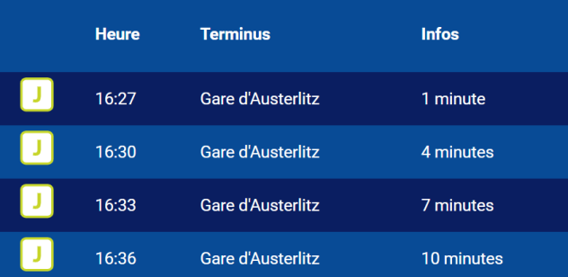

## Installation du Sensor

### Custom Component

Copier le repertoire `custom_components` dans `/config/custom_components`, modifier la config comme indiqué ci dessous puis rémarrer Home Assistant.  
Vous devriez voir arriver un `sensor.prochain_rer` avec le nombre de minutes avant le prochain train. 

### Config Transilien
Dans le cas `api: transilien`.  
Tout d'abord, trouver le code de votre gare et de la gare d'arrivée (sur la meme ligne).  
Le fichier `gares.json` contient les gares RER du réseau.

Ensuite, trouver des codes pour intérroger l'API transilien.
Voir [ici](https://ressources.data.sncf.com/explore/dataset/api-temps-reel-transilien/information/).

Enfin, dans le fichier `configuration.yaml`, déclarer le `sensor`.

```yaml
sensor:
  - platform: prochains_rer
    api: transilien
    from: '87381087' 
    to: '87381087' 
    api_auth:
        username: !secret transilien_username
        password: !secret transilien_password
```

### Config RATP
Dans le cas `api: ratp`.  
Voir ici la documentation de l'API : https://github.com/pgrimaud/horaires-ratp-api.  
Le paramètre `path` correspond à l'URL après `schedules` dans les exemples du site.

```yaml
sensor:
  - platform: prochains_rer
    name: prochains_metro
    api: ratp
    path: metros/8/daumesnil/R
```

## Lovelace

Copier le repertoire `www/dist` dans `/config/www/prochains_rer`.  
Ajouter une ressource Lovelace de type `Module JavaScript` avec comme valeur `/local/prochains_rer/prochains-rer.js`.  
Ajouter une carte avec comme config:
```yaml
type: 'custom:x-prochains-rer'
icon: c # icon de la ligne ou lien https vers un icon
max_trains: 5
entities:
  - sensor.prochains_rer
```
